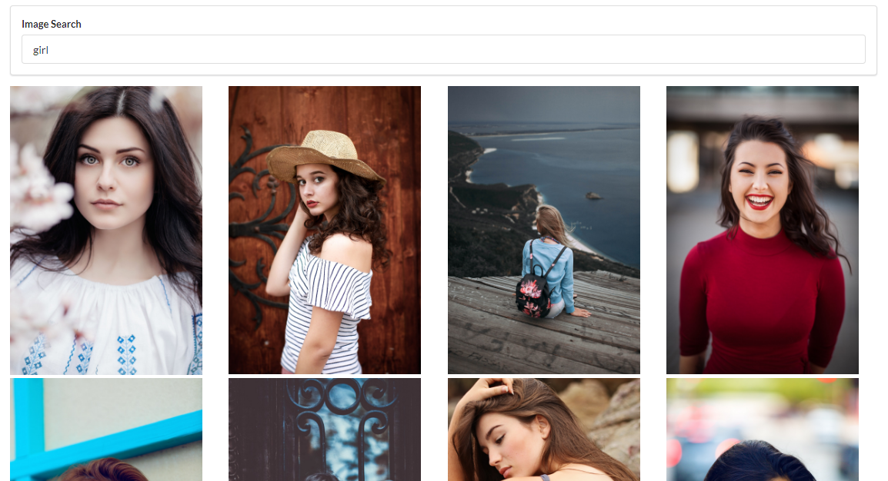

# React Pics

> Simple React application to show different images based on your search.

> Search results will be shown in a grid as shown in the below.

    

## Technologies Used
> Javascript, React, Axios, Semantic UI, CSS, HTML5

## Data API
> Fetching image data is done by using an API exposed via [Unsplash](https://unsplash.com/) image source.